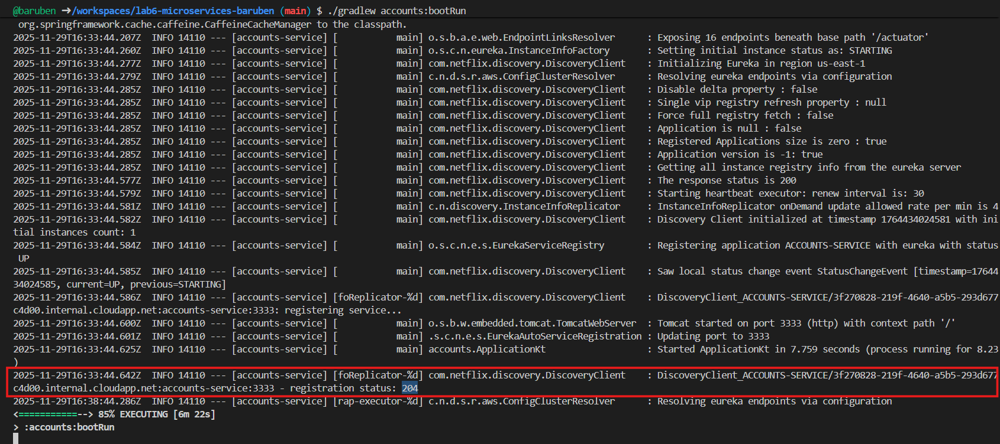
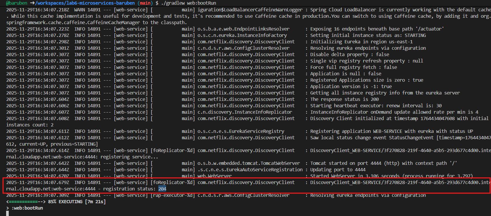
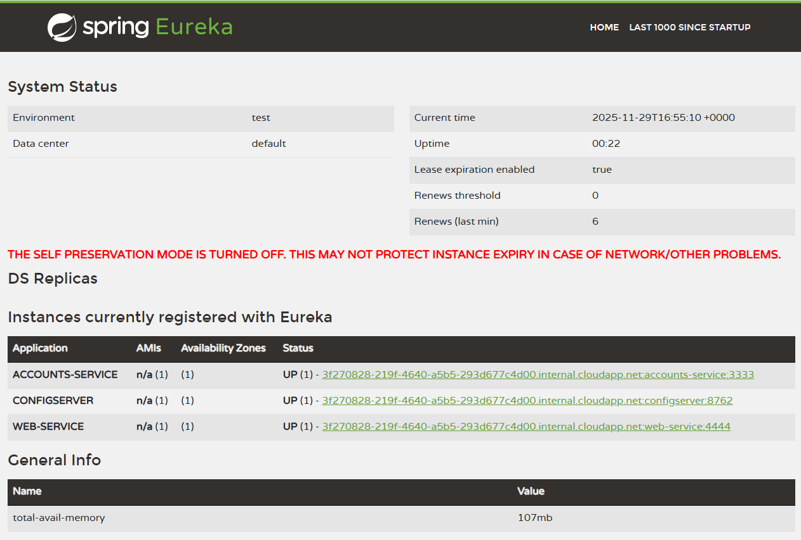
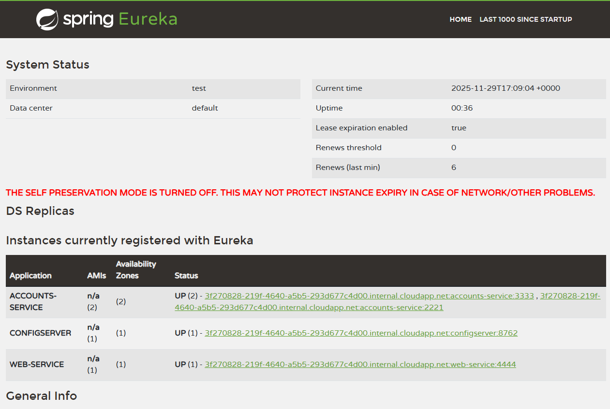
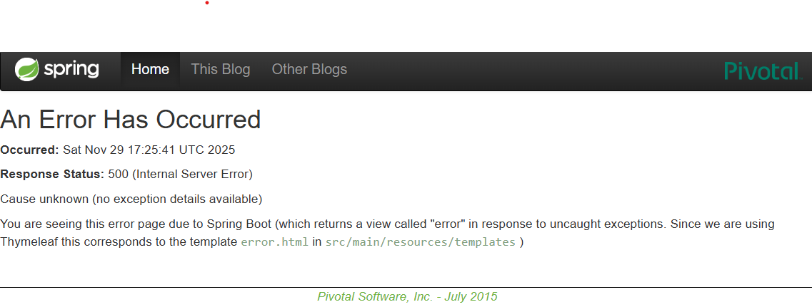
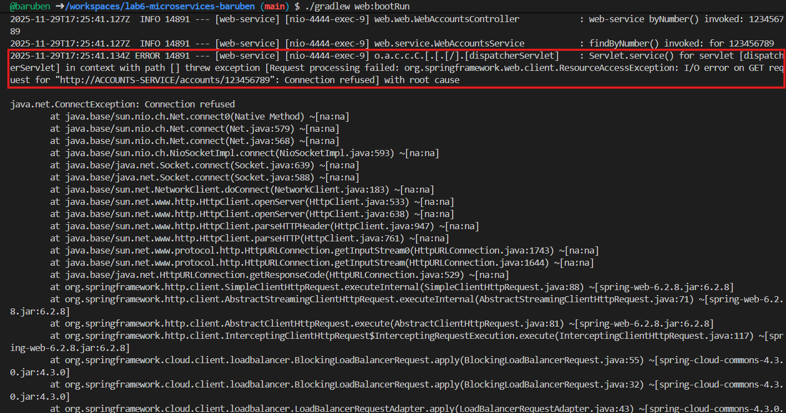
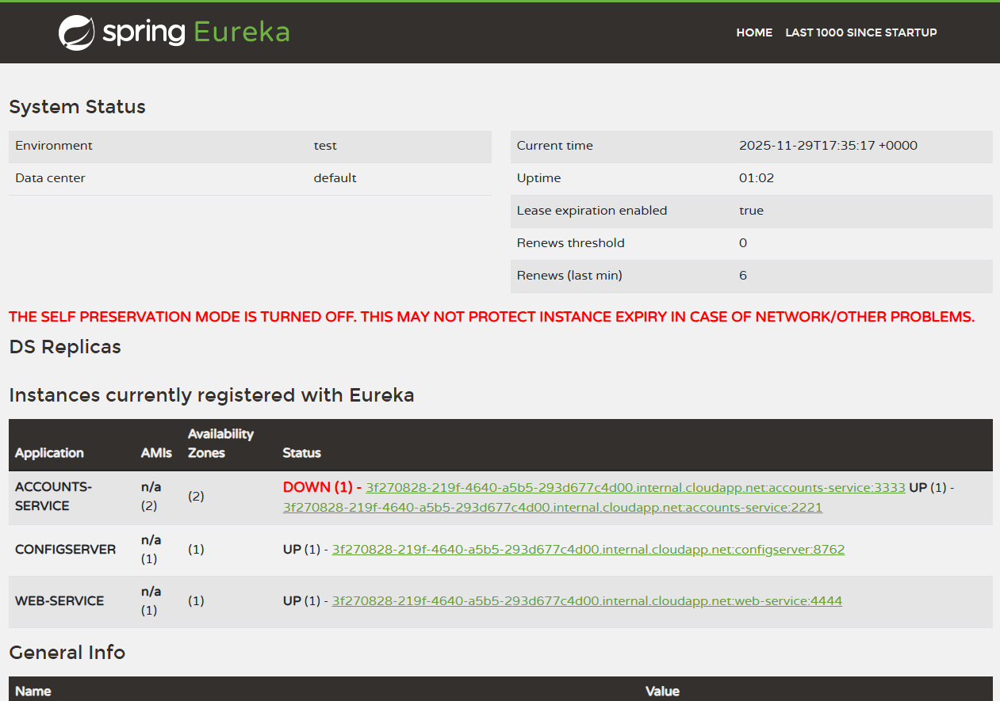
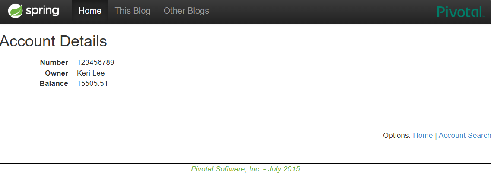
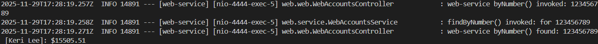

# Lab 6 Microservices - Project Report

## 1. Configuration Setup

**Configuration Repository**: [Link to your forked repository]

Describe the changes you made to the configuration:

- What did you modify in `accounts-service.yml`?

The port where the service should be launched
From:
```yml
server:
  port: 3333   # HTTP (Tomcat) port
```

To
```yml
server:
  port: 2222   # HTTP (Tomcat) port
```

> Note:
> In Github CodeSpaces port 2222 was unavailable and it had to be changed to `2221`.
> Therefore in screnshots port 2221 will appear instead of port 2222.

- Why is externalized configuration useful in microservices?

Externalized configuration allows services to be configured dynamically **without rebuilding or redeploying the entire application**. In microservices, multiple instances may run in different environments (dev, staging, production), so centralizing config makes scaling and modifying settings much easier and reduces the risk of inconsistencies.

---

## 2. Service Registration (Task 1)

### Accounts Service Registration



Explain what happens during service registration.

When a Spring Boot microservice starts, it goes through several initialization phases before it becomes discoverable by other services. Service registration refers to the process by which a service identifies itself and announces its availability to the service registry (Eureka).

1. **Application Startup**: The microservice launches, fetches configuration from *config-server*, initializes its context, beans, database connections, and embedded server. At this point the service is running locally but is **not yet registered or discoverable**.

```
2025-11-29T16:33:38.312Z  INFO 14110 --- [accounts-service] [           main] accounts.ApplicationKt                   : Starting ApplicationKt using Java 17.0.17 with PID 14110 (...)
...
2025-11-29T16:33:38.355Z  INFO 14110 --- [accounts-service] [           main] o.s.c.c.c.ConfigServerConfigDataLoader   : Fetching config from server at : http://localhost:8762
2025-11-29T16:33:38.356Z  INFO 14110 --- [accounts-service] [           main] o.s.c.c.c.ConfigServerConfigDataLoader   : Located environment: name=accounts-service, profiles=[default], label=null, version=null, state=null
2025-11-29T16:33:39.876Z  INFO 14110 --- [accounts-service] [           main] .s.d.r.c.RepositoryConfigurationDelegate : Bootstrapping Spring Data JPA repositories in DEFAULT mode.
2025-11-29T16:33:40.065Z  INFO 14110 --- [accounts-service] [           main] .s.d.r.c.RepositoryConfigurationDelegate : Finished Spring Data repository scanning in 181 ms. Found 1 JPA repository interface.
2025-11-29T16:33:40.269Z  INFO 14110 --- [accounts-service] [           main] o.s.cloud.context.scope.GenericScope     : BeanFactory id=e7a61537-c147-3e5e-af75-7c19be8b1d4c
2025-11-29T16:33:40.562Z  INFO 14110 --- [accounts-service] [           main] o.s.b.w.embedded.tomcat.TomcatWebServer  : Tomcat initialized with port 3333 (http)
2025-11-29T16:33:40.573Z  INFO 14110 --- [accounts-service] [           main] o.apache.catalina.core.StandardService   : Starting service [Tomcat]
2025-11-29T16:33:40.573Z  INFO 14110 --- [accounts-service] [           main] o.apache.catalina.core.StandardEngine    : Starting Servlet engine: [Apache Tomcat/10.1.42]
2025-11-29T16:33:40.621Z  INFO 14110 --- [accounts-service] [           main] o.a.c.c.C.[Tomcat].[localhost].[/]       : Initializing Spring embedded WebApplicationContext
...
2025-11-29T16:33:42.798Z  INFO 14110 --- [accounts-service] [           main] j.LocalContainerEntityManagerFactoryBean : Initialized JPA EntityManagerFactory for persistence unit 'default'
2025-11-29T16:33:43.100Z  INFO 14110 --- [accounts-service] [           main] o.s.d.j.r.query.QueryEnhancerFactory     : Hibernate is in classpath; If applicable, HQL parser will be used.
Hibernate: select count(a1_0.id) from t_account a1_0
2025-11-29T16:33:43.631Z  INFO 14110 --- [accounts-service] [           main] accounts.web.AccountsController          : AccountRepository says system has 21 accounts
2025-11-29T16:33:43.655Z  WARN 14110 --- [accounts-service] [           main] JpaBaseConfiguration$JpaWebConfiguration : spring.jpa.open-in-view is enabled by default. Therefore, database queries may be performed during view rendering. Explicitly configure spring.jpa.open-in-view to disable this warning
2025-11-29T16:33:43.674Z  INFO 14110 --- [accounts-service] [           main] o.s.b.a.w.s.WelcomePageHandlerMapping    : Adding welcome page template: index
```

2. **Eureka Client Initialization**: The Eureka client component activates. It prepares metadata about the service instance (name, IP, port, status, health endpoints) and sets its initial state to: `STATUS = STARTING`. This means the service is running but not yet healthy or ready for discovery.

```
2025-11-29T16:33:44.178Z  INFO 14110 --- [accounts-service] [           main] DiscoveryClientOptionalArgsConfiguration : Eureka HTTP Client uses RestTemplate.
2025-11-29T16:33:44.203Z  WARN 14110 --- [accounts-service] [           main] iguration$LoadBalancerCaffeineWarnLogger : Spring Cloud LoadBalancer is currently working with the default cache. While this cache implementation is useful for development and tests, it's recommended to use Caffeine cache in production.You can switch to using Caffeine cache, by adding it and org.springframework.cache.caffeine.CaffeineCacheManager to the classpath.
2025-11-29T16:33:44.207Z  INFO 14110 --- [accounts-service] [           main] o.s.b.a.e.web.EndpointLinksResolver      : Exposing 16 endpoints beneath base path '/actuator'
2025-11-29T16:33:44.260Z  INFO 14110 --- [accounts-service] [           main] o.s.c.n.eureka.InstanceInfoFactory       : Setting initial instance status as: STARTING
```

3. **Fetching Registry from Eureka Server**: The service contacts the Eureka Server at the default port and retrieves the current list of registered services. This ensures the instance is aware of the service ecosystem before joining it. If the connection is successful, Eureka returns a 200 HTTP status.

```
2025-11-29T16:33:44.277Z  INFO 14110 --- [accounts-service] [           main] com.netflix.discovery.DiscoveryClient    : Initializing Eureka in region us-east-1
2025-11-29T16:33:44.279Z  INFO 14110 --- [accounts-service] [           main] c.n.d.s.r.aws.ConfigClusterResolver      : Resolving eureka endpoints via configuration
...
2025-11-29T16:33:44.285Z  INFO 14110 --- [accounts-service] [           main] com.netflix.discovery.DiscoveryClient    : Getting all instance registry info from the eureka server
2025-11-29T16:33:44.577Z  INFO 14110 --- [accounts-service] [           main] com.netflix.discovery.DiscoveryClient    : The response status is 200
```

4. **Registration Request Sent to Eureka**: Once initialization is complete and the service is healthy, Eureka registers the service. The internal status changes to: `STATUS = UP`. At this moment, the service officially announces itself to Eureka. Metadata like hostname, instance ID, port, and status are recorded.

```
2025-11-29T16:33:44.579Z  INFO 14110 --- [accounts-service] [           main] com.netflix.discovery.DiscoveryClient    : Starting heartbeat executor: renew interval is: 30
2025-11-29T16:33:44.581Z  INFO 14110 --- [accounts-service] [           main] c.n.discovery.InstanceInfoReplicator     : InstanceInfoReplicator onDemand update allowed rate per min is 4
2025-11-29T16:33:44.582Z  INFO 14110 --- [accounts-service] [           main] com.netflix.discovery.DiscoveryClient    : Discovery Client initialized at timestamp 1764434024581 with initial instances count: 1
2025-11-29T16:33:44.584Z  INFO 14110 --- [accounts-service] [           main] o.s.c.n.e.s.EurekaServiceRegistry        : Registering application ACCOUNTS-SERVICE with eureka with status UP
2025-11-29T16:33:44.585Z  INFO 14110 --- [accounts-service] [           main] com.netflix.discovery.DiscoveryClient    : Saw local status change event StatusChangeEvent [timestamp=1764434024585, current=UP, previous=STARTING]
2025-11-29T16:33:44.586Z  INFO 14110 --- [accounts-service] [foReplicator-%d] com.netflix.discovery.DiscoveryClient    : DiscoveryClient_ACCOUNTS-SERVICE/3f270828-219f-4640-a5b5-293d677c4d00.internal.cloudapp.net:accounts-service:3333: registering service...
2025-11-29T16:33:44.600Z  INFO 14110 --- [accounts-service] [           main] o.s.b.w.embedded.tomcat.TomcatWebServer  : Tomcat started on port 3333 (http) with context path '/'
2025-11-29T16:33:44.601Z  INFO 14110 --- [accounts-service] [           main] .s.c.n.e.s.EurekaAutoServiceRegistration : Updating port to 3333
2025-11-29T16:33:44.642Z  INFO 14110 --- [accounts-service] [foReplicator-%d] com.netflix.discovery.DiscoveryClient    : DiscoveryClient_ACCOUNTS-SERVICE/3f270828-219f-4640-a5b5-293d677c4d00.internal.cloudapp.net:accounts-service:3333 - registration status: 204
```

### Web Service Registration



Explain how the web service discovers the accounts service.

When the *web-service* starts, it registers itself with the Eureka discovery server and then uses Eureka to locate and communicate with the *accounts-service*. Discovery happens through a combination of registration, registry synchronization, and load-balanced HTTP requests.

1. **Web Service Registers with Eureka**: After startup and configuration loading, the service initializes the Eureka client. Its status transitions from `STATUS = STARTING` to `STATUS = UP` and it successfully registers with the Eureka server. At this point, *web-service* becomes **discoverable by others** and can also **discover other registered services**.

```
2025-11-29T16:34:05.423Z  INFO 14891 --- [web-service] [           main] web.WebServer                            : Starting WebServer using Java 17.0.17 with PID 14891 (/workspaces/lab6-microservices-baruben/web/build/classes/java/main started by codespace in /workspaces/lab6-microservices-baruben/web)
2025-11-29T16:34:05.426Z  INFO 14891 --- [web-service] [           main] web.WebServer                            : No active profile set, falling back to 1 default profile: "default"
2025-11-29T16:34:05.460Z  INFO 14891 --- [web-service] [           main] o.s.c.c.c.ConfigServerConfigDataLoader   : Fetching config from server at : http://localhost:8762
2025-11-29T16:34:05.460Z  INFO 14891 --- [web-service] [           main] o.s.c.c.c.ConfigServerConfigDataLoader   : Located environment: name=web-service, profiles=[default], label=null, version=null, state=null
2025-11-29T16:34:06.289Z  INFO 14891 --- [web-service] [           main] o.s.cloud.context.scope.GenericScope     : BeanFactory id=ced5f2be-be04-3a1d-83ce-97d8711a8d90
2025-11-29T16:34:06.471Z  INFO 14891 --- [web-service] [           main] o.s.b.w.embedded.tomcat.TomcatWebServer  : Tomcat initialized with port 4444 (http)
2025-11-29T16:34:06.481Z  INFO 14891 --- [web-service] [           main] o.apache.catalina.core.StandardService   : Starting service [Tomcat]
2025-11-29T16:34:06.481Z  INFO 14891 --- [web-service] [           main] o.apache.catalina.core.StandardEngine    : Starting Servlet engine: [Apache Tomcat/10.1.42]
2025-11-29T16:34:06.539Z  INFO 14891 --- [web-service] [           main] o.a.c.c.C.[Tomcat].[localhost].[/]       : Initializing Spring embedded WebApplicationContext
2025-11-29T16:34:06.541Z  INFO 14891 --- [web-service] [           main] w.s.c.ServletWebServerApplicationContext : Root WebApplicationContext: initialization completed in 1077 ms
2025-11-29T16:34:06.728Z  WARN 14891 --- [web-service] [           main] web.service.WebAccountsService           : The RestTemplate request factory is org.springframework.http.client.SimpleClientHttpRequestFactory@2fb082ff
2025-11-29T16:34:06.756Z  INFO 14891 --- [web-service] [           main] o.s.b.a.w.s.WelcomePageHandlerMapping    : Adding welcome page template: index
2025-11-29T16:34:07.189Z  INFO 14891 --- [web-service] [           main] DiscoveryClientOptionalArgsConfiguration : Eureka HTTP Client uses RestTemplate.
2025-11-29T16:34:07.218Z  WARN 14891 --- [web-service] [           main] iguration$LoadBalancerCaffeineWarnLogger : Spring Cloud LoadBalancer is currently working with the default cache. While this cache implementation is useful for development and tests, it's recommended to use Caffeine cache in production.You can switch to using Caffeine cache, by adding it and org.springframework.cache.caffeine.CaffeineCacheManager to the classpath.
2025-11-29T16:34:07.223Z  INFO 14891 --- [web-service] [           main] o.s.b.a.e.web.EndpointLinksResolver      : Exposing 16 endpoints beneath base path '/actuator'
2025-11-29T16:34:07.278Z  INFO 14891 --- [web-service] [           main] o.s.c.n.eureka.InstanceInfoFactory       : Setting initial instance status as: STARTING
...
2025-11-29T16:34:07.307Z  INFO 14891 --- [web-service] [           main] com.netflix.discovery.DiscoveryClient    : Getting all instance registry info from the eureka server
2025-11-29T16:34:07.604Z  INFO 14891 --- [web-service] [           main] com.netflix.discovery.DiscoveryClient    : The response status is 200
2025-11-29T16:34:07.606Z  INFO 14891 --- [web-service] [           main] com.netflix.discovery.DiscoveryClient    : Starting heartbeat executor: renew interval is: 30
2025-11-29T16:34:07.607Z  INFO 14891 --- [web-service] [           main] c.n.discovery.InstanceInfoReplicator     : InstanceInfoReplicator onDemand update allowed rate per min is 4
2025-11-29T16:34:07.608Z  INFO 14891 --- [web-service] [           main] com.netflix.discovery.DiscoveryClient    : Discovery Client initialized at timestamp 1764434047608 with initial instances count: 2
2025-11-29T16:34:07.611Z  INFO 14891 --- [web-service] [           main] o.s.c.n.e.s.EurekaServiceRegistry        : Registering application WEB-SERVICE with eureka with status UP
2025-11-29T16:34:07.612Z  INFO 14891 --- [web-service] [           main] com.netflix.discovery.DiscoveryClient    : Saw local status change event StatusChangeEvent [timestamp=1764434047612, current=UP, previous=STARTING]
2025-11-29T16:34:07.614Z  INFO 14891 --- [web-service] [foReplicator-%d] com.netflix.discovery.DiscoveryClient    : DiscoveryClient_WEB-SERVICE/3f270828-219f-4640-a5b5-293d677c4d00.internal.cloudapp.net:web-service:4444: registering service...
2025-11-29T16:34:07.642Z  INFO 14891 --- [web-service] [           main] o.s.b.w.embedded.tomcat.TomcatWebServer  : Tomcat started on port 4444 (http) with context path '/'
2025-11-29T16:34:07.644Z  INFO 14891 --- [web-service] [           main] .s.c.n.e.s.EurekaAutoServiceRegistration : Updating port to 4444
2025-11-29T16:34:07.670Z  INFO 14891 --- [web-service] [           main] web.WebServer                            : Started WebServer in 3.106 seconds (process running for 3.797)
2025-11-29T16:34:07.679Z  INFO 14891 --- [web-service] [foReplicator-%d] com.netflix.discovery.DiscoveryClient    : DiscoveryClient_WEB-SERVICE/3f270828-219f-4640-a5b5-293d677c4d00.internal.cloudapp.net:web-service:4444 - registration status: 204
```

2. **Web Service Fetches the Eureka Registry**: Before making any remote call, Eureka downloads the registry. The count `2` indicates that more than one service is registered (one of those is *accounts-service*). This gives *web-service* the information it needs to locate the accounts microservice dynamically.

```
2025-11-29T16:34:07.608Z  INFO 14891 --- [web-service] [           main] com.netflix.discovery.DiscoveryClient    : Discovery Client initialized at timestamp 1764434047608 with initial instances count: 2
```

3. **Service Lookup Happens Through Eureka**: When *web-service* needs account data, it does **not** request using a physical host or port.  
Instead, it makes a request using the service ID `ACCOUNTS-SERVICE`. Eureka resolves this ID into a real instance address automaticly and transparently.

4. **Communication via Load-Balanced Client**: Once the address is resolved, requests are routed using Spring Cloud LoadBalancer and a `RestTemplate` configured with Eureka support. The call looks conceptually like: `http://ACCOUNTS-SERVICE/accounts/`. Eureka replaces `ACCOUNTS-SERVICE` with the actual IP + port of the running instance: `http://localhost:3333`.

```kotlin
@Configuration
public class WebServerConfiguration {
    /**
     * URL uses the logical name of account-service - upper or lower case,
     * doesn't matter.
     *
     * This is NOT a real URL! The string "ACCOUNTS-SERVICE" is a
     * logical service name registered with Eureka. When a @LoadBalanced RestTemplate
     * makes a request, Spring Cloud will:
     * 1. Query Eureka for instances of "ACCOUNTS-SERVICE"
     * 2. Select an available instance (load balancing)
     * 3. Replace "ACCOUNTS-SERVICE" with the actual URL (e.g., "http://localhost:3333")
     *
     * This enables dynamic service discovery without hardcoding URLs.
     */
    private static final String ACCOUNTS_SERVICE_URL = "http://ACCOUNTS-SERVICE";

    /**
     * The AccountService encapsulates the interaction with the micro-service.
     *
     * @return A new service instance.
     */
    @Bean
    public WebAccountsService accountsService() {
        return new WebAccountsService(ACCOUNTS_SERVICE_URL, restTemplate());
    }

    /**
     * Creates a RestTemplate bean with client-side load balancing enabled.
     *
     * The @LoadBalanced annotation is crucial for microservices:
     * - It enables Eureka service discovery: RestTemplate will query Eureka to find
     *   instances of services by name (e.g., "ACCOUNTS-SERVICE")
     * - It enables client-side load balancing: When multiple instances exist, requests
     *   are distributed across them (round-robin by default)
     * - It provides resilience: If one instance fails, requests automatically route
     *   to healthy instances
     *
     * Without @LoadBalanced, RestTemplate would treat "ACCOUNTS-SERVICE" as a literal
     * hostname and fail to connect.
     *
     * @return A RestTemplate configured for service discovery and load balancing
     */
    @LoadBalanced
    @Bean
    public RestTemplate restTemplate() {
        return new RestTemplate();
    }
}
```

---

## 3. Eureka Dashboard (Task 2)



Describe what the Eureka dashboard shows:

- Which services are registered?

  - ACCOUNTS-SERVICE
  - CONFIG-SERVER
  - WEB-SERVICE

- What information does Eureka track for each instance?

Eureka stores and displays for each instance:

| Category | Examples | Screenshot |
|----------|----------|------------|
| Identity | Service name, instance ID | ACCOUNTS-SERVICE 
| | | WEB-SERVICE
| | | CONFIGSERVER
| Network info | Hostname, IP, port | 3f270828-219f-4640-a5b5-293d677c4d00.internal.cloudapp.net:accounts-service:3333
| | |ipAddr = 10.0.0.154
| Health status | UP / DOWN | Status: UP
| Region/zone data | Data center, availability zone | AMIs: n/a (1)
| | | Availability Zones: (1)
| | | Data center: default
| Heartbeat tracking | Lease, renew rate & expiration | Lease expiration enabled: true
| | | Renews (last min): 6
| | | Renews threshold: 0
| Runtime metadata | Uptime, memory usage, CPU | Uptime: 00:22
| | | current-memory-usage: 62mb (57%)
| | | num-of-cpus: 2

**It functions as both a registry and a health monitor**, tracking everything needed for service discovery and reliable communication between microservices.

---

## 4. Multiple Instances (Task 4)



Answer the following questions:

- What happens when you start a second instance of the accounts service?

Both instances register under the same service ID: **ACCOUNTS-SERVICE**. Eureka now keeps **two separate instance records**, each with its own port/URL

The dashboard shows `UP (2)` instead of `UP (1)`

```
UP (2) - 3f270828-219f-4640-a5b5-293d677c4d00.internal.cloudapp.net:accounts-service:3333 , 3f270828-219f-4640-a5b5-293d677c4d00.internal.cloudapp.net:accounts-service:2221
```

Eureka recognises them as identical service providers with different network endpoints.

- How does Eureka handle multiple instances?

Eureka treats all instances of the same service as a **pool of available nodes**.   Each is listed separately, with its own:

  - instance ID
  - hostname/IP
  - port
  - health status (`UP`, `DOWN`, etc.)

Eureka will keep track of both instances, monitor each individually via heartbeats and deregister one if it stops renewing or goes down.  

This allows services to scale horizontally and survive instance failures. If one instance fails, the others remain available.

- How does client-side load balancing work with multiple instances?

When a client (e.g., web-service) requests `ACCOUNTS-SERVICE`, it receives a list of **all available instances** from Eureka. The load balancer (Spring Cloud LoadBalancer) selects **one instance per request**, using a specific strategy. This balances traffic and prevents one instance from being overloaded.

---

## 5. Service Failure Analysis (Task 5)

### Initial Failure





Describe what happens immediately after stopping the accounts service on port 3333.

When the accounts-service instance running on **port 3333** stops, several things take place almost instantly across the system:
- Each registered service sends regular heartbeat signals to Eureka to confirm it's alive. Once the 3333 instance is terminated:
  - Heartbeats from that instance stop
  - Eureka marks the instance as **DOWN** (after a short delay depending on lease expiry settings)
  - Eventually it will be **deregistered** from the registry

- Because *web-service* had been routing traffic to **port 3333** at the time it shut down:
  - The next request results in `Connection refused`
  - The error appears immediately because there is no response from the now-offline instance

### Eureka Instance Removal



Explain how Eureka detects and removes the failed instance:

- How long did it take for Eureka to remove the dead instance?

Given the configuration:

```yaml
eviction-interval-timer-in-ms: 1000
```

Eureka is configured to scan for expired instances **every 1 second**. Therefore, once the accounts service on port 3333 stopped:
1. Eureka waited until the next eviction cycle (≈ 1 second later)
2. Detected the missing heartbeat
3. Removed the instance almost immediately

- What mechanism does Eureka use to detect failures?

Eureka relies on **heartbeats (renewals)** sent periodically by each registered service.
If a service stops sending heartbeat signals:
1. Eureka marks the instance as `DOWN`
2. After the lease expires, the instance is **evicted**
3. The eviction cycle checks this on a timer (1s in discovery's `application.yml`)

This process is known as **lease expiration + heartbeat renewal failure detection**.

---

## 6. Service Recovery Analysis (Task 6)





Answer the following questions:

- Why does the web service eventually recover?
The recovery happens because the web-service **continuously refreshes service information from Eureka**.  
After the failed instance is removed from the registry, the client discovers that a new valid instance exists (port 2221) and switches requests to it.

This process involves:

1. The old instance stops sending heartbeats.
2. Eureka evicts it from the registry.
3. The discovery client inside web-service updates its local cache.
4. Load balancer reroutes requests to the still-available instance (2221).

- How long did recovery take?
Recovery time depends on two factors:

| Delay Component | Typical Duration in your setup |
|----------------|-------------------------------|
| Eureka eviction time | ~1 second (configured) |
| Client cache refresh time | 30s default heartbeat/refresh cycle unless modified |

So recovery usually occurs when the **client next refreshes its registry cache**, meaning `recovery time ≈ ~1–30 seconds` depending on refresh interval. Because eviction is almost instant (1s), **the dominant delay is the client registry refresh**, not Eureka itself.

- What role does client-side caching play in the recovery process?

Eureka uses **client-side caching**, meaning each service maintains a **local copy of the registry** rather than querying Eureka for every request.

This improves performance but introduces recovery delay:

| Benefit | Drawback |
|--------|----------|
| Faster request routing | Changes aren’t seen instantly |
| No constant lookup overhead | Failures take time to propagate |
| Reduces network load | Cached dead instances cause temporary errors |

So the web-service keeps trying to call the old instance **until its cache refreshes**, after which it notices the working instance and resumes functioning normally.

---

## 7. API Gateway (Bonus 1)

---

## 8. Security with OAuth2/JWT (Bonus 2)

---

## 9. Conclusions

Summarize what you learned about:

- Microservices architecture
- Service discovery with Eureka
- System resilience and self-healing
- Challenges you encountered and how you solved them

---

## 10. AI Disclosure

**Did you use AI tools?** (ChatGPT, Copilot, Claude, etc.)

- If YES: Which tools? What did they help with? What did you do yourself?
- If NO: Write "No AI tools were used."

**Important**: Explain your own understanding of microservices patterns and Eureka behavior, even if AI helped you write parts of this report.

---

## Additional Notes

Any other observations or comments about the assignment.

